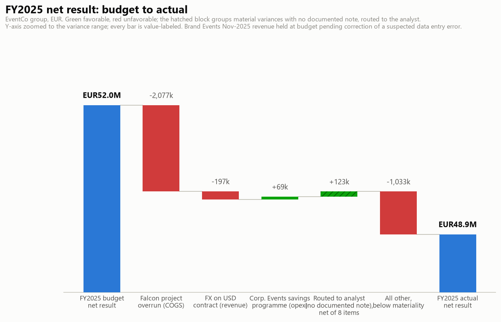
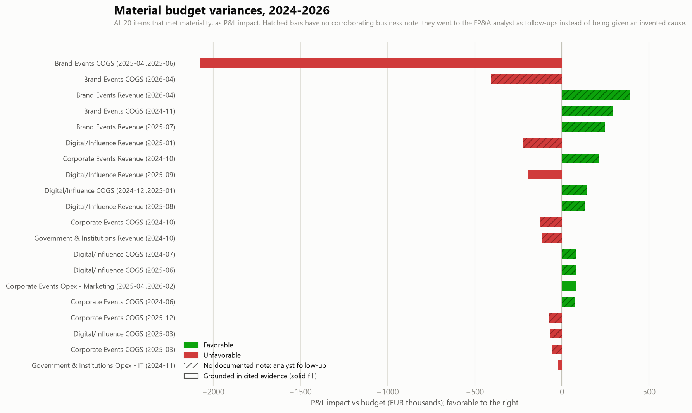
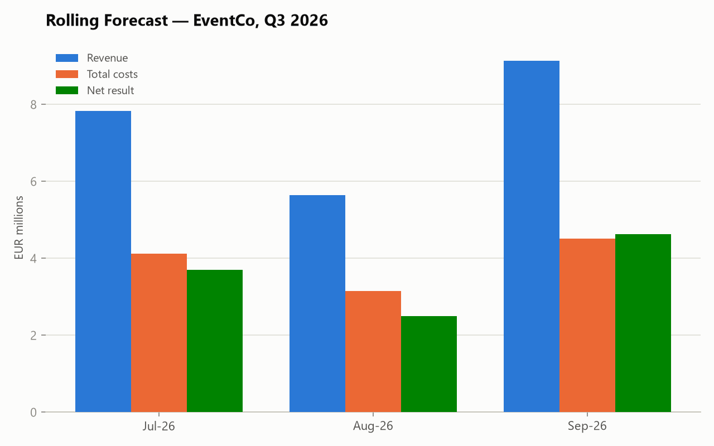
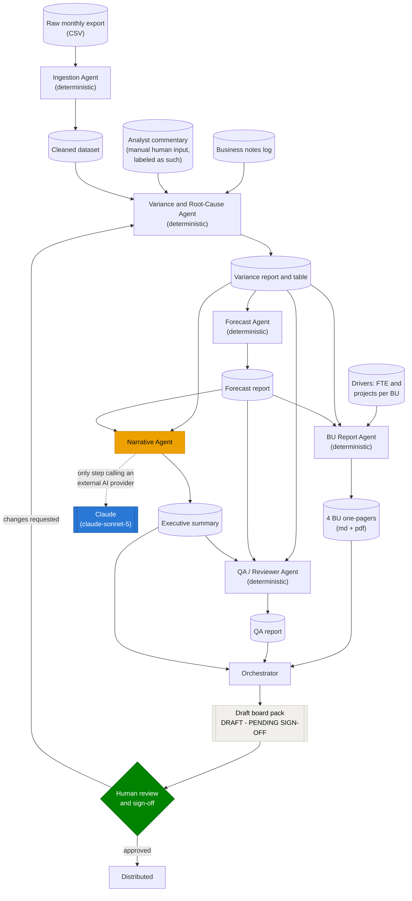

# EventCo FP&A: the monthly close, run by software, signed by a human

AI applied to the finance function, in a form a finance team could actually adopt. This
repo runs a complete monthly FP&A cycle for a fictional EUR100M events agency: it cleans
the raw accounting export, explains Budget vs Actual variances with documented evidence,
refreshes the rolling 3-month forecast, writes the executive commentary, builds a
driver-based one-pager for every business unit, and assembles a board pack that always
stops at a human sign-off. Every number is reproducible, every claim is checkable, and a
CFO can run the whole thing with one command.

EventCo is fictional, but its monthly close is not. I ran this cycle for real at a
EUR100M events agency, including stepping in to close the books when the finance director
was out. The overruns, the currency hits and the fat-fingered digits planted in this
dataset are the ones that actually happen; this repo shows what that cycle looks like
when software does the repetitive part and a human keeps the final word.

**Rather see it than read it?** The 2-minute version, with the real artifacts:
**[the live showcase](https://alanvourch.com/fpa-project/)**.

Under the hood this is a small team of single-purpose agents chained through real files.
Five of the six are plain, auditable Python; exactly one step calls an LLM, and a QA
agent verifies that boundary on every run by scanning the source code.

Two design principles run through everything here, because they are what a real finance
team would demand before trusting any of this:

1. **A human stays in charge.** The pipeline assembles a draft and stops. Nothing is
   emailed, published, or distributed by code.
2. **If there is no evidence, route it to a human.** The system explains a variance only
   when a documented business note corroborates it (4 of the 20 material variances here).
   Everything else goes to the FP&A analyst as a follow-up; the analyst's written
   explanations come back through a separate input file and are labeled as manual input
   (14 of 20), and whatever is still open says so plainly (2 of 20). The system itself
   never invents a plausible-sounding cause, and a reader can always tell which kind of
   explanation they are looking at.

## Problem

A monthly Budget vs Actual cycle across several business units is slow, repetitive, and
inconsistent between analysts: clean the source data, compute variances, decide which are
material, defend a root cause for each, refresh the forecast, and package it for a CFO,
usually by hand, every month. Two failure modes recur:

- **A data-entry typo becomes a business story.** Someone books EUR52M of revenue instead
  of EUR5.2M, and a rushed analyst writes a confident narrative around a fat-fingered
  digit.
- **A material variance gets a vague cause, or none.** Under time pressure, "timing" and
  "mix effects" cover a lot of numbers nobody actually investigated.

This project targets both failure modes directly, and the synthetic dataset plants both:
four real business anomalies with documented causes, six categories of data-quality mess,
and one deliberate trap (a 10x revenue typo shaped exactly like a huge business anomaly).

## What it does

Six agents, each handling one stage and handing off through real files, not hidden calls
inside one black box:

1. **Ingestion** cleans the raw export (typos, duplicates, currency-formatted text, mixed
   date formats, missing values) and flags the 10x revenue row as a probable data-entry
   error, without correcting it. That decision stays with a human.
2. **Variance & Root-Cause** computes all 840 BU/line/month variances, applies a
   three-rule materiality test, and explains a variance only when a dated internal
   business note corroborates it. Anything unexplained goes to the FP&A analyst as a
   follow-up; the analyst's findings come back through `data/analyst_commentary.csv` and
   are rendered clearly labeled as manual input, never blended with machine-found
   evidence. Items with neither say "no clear driver identified" and stay open. The
   flagged data-error row is excluded before analysis, so the typo can never be dressed
   up as a story.
3. **Forecast** projects the next three months from a normalized history: one-off events
   and concluded programmes are removed from the base so last year's accident is not
   re-forecast as this year's plan. Every adjustment is logged in an audit trail with its
   evidence.
4. **BU Reports** builds a one-page business review per business unit from the variance
   table, the forecast and the operational drivers (monthly FTE and projects delivered
   per BU): a budget-to-actual bridge, the payroll variance split into headcount vs rate,
   the revenue variance split into volume vs price/mix (both reconcile exactly,
   asserted), the BU's material variances with their grounded explanations, follow-ups,
   and next quarter's outlook. Exported as Markdown and a print-ready PDF per BU.
5. **Narrative** turns the two finished reports into an executive summary. This is the
   only step that calls an LLM (Claude), and it is instructed never to introduce a
   number, cause, or conclusion that is not already in its inputs. A validation script
   then traces every figure in the prose back to a source figure (tolerance: 0.5%
   relative and EUR15,000 absolute, both required).
6. **QA/Reviewer** cross-checks the other agents' outputs against each other and
   verifies, by scanning the actual source code, that only the Narrative Agent references
   an external AI provider and that its file reads are limited to the two aggregated
   reports.

An **Orchestrator** runs all six as separate processes and assembles
`output/board_pack.md`, which ends in a literal DRAFT banner and a reviewed-by /
approved-for-distribution sign-off block.

## Results

On the synthetic 30-month dataset (4 business units, ~EUR100M annual revenue):

- **The FY2025 walk from budget to actual reconciles to the euro.** Budgeted net result
  EUR52.0M, actual EUR48.9M. The three named drivers: a EUR2.08M client project overrun
  (change order recovered only part of it), a EUR197k unfavorable FX translation on a
  USD-invoiced contract, and EUR69k of in-housing savings on marketing spend in 2025.
  Material items with no documented note net out to +EUR123k and are shown as their own
  hatched block, labeled as routed to the analyst, rather than absorbed into a story.



- **The one planted data trap was caught.** Brand Events' November 2025 revenue came in at
  10x budget, the signature of an extra digit, not a business event. It was flagged at
  ingestion, excluded from variance analysis, normalized out of the forecast history, and
  mentioned in the executive summary only as a data issue pending correction. Every
  downstream agent handled it; none narrated it.
- **The machine-versus-human boundary is visible on every variance.** The system
  attributed a cause to only the 4 material variances a documented note corroborates. The
  other 16 went to the FP&A analyst as follow-ups: 14 now carry the analyst's written
  explanation, labeled "Analyst input" with author and date, and 2 remain open and say
  so. That split (4 documented, 14 analyst-explained, 2 open) is a realistic monthly
  close, and keeping the three types visibly distinct is the core discipline this
  pipeline demonstrates. (The analyst commentary in this demo is authored narrative; see
  Known limitations.)



- **Every business unit gets a one-page review with driver-based commentary.** Brand
  Events' FY2025 page splits its payroll variance into a headcount effect (average 54.6
  FTE vs 55 planned) and a rate effect, and its revenue variance into projects volume (146
  delivered vs 141 planned) and price/mix. Both splits reconcile exactly to the reported
  variances (asserted in code, re-checked by a validator), and the commentary cites the
  same evidence notes as the variance report. See
  [`output/bu_reports/brand_events.pdf`](output/bu_reports/brand_events.pdf) and its three
  siblings, each also available as Markdown.

- **The Q3 2026 rolling forecast projects EUR22.6M revenue at a 47.9% margin**, built
  from each line's own seasonal base and median year-over-year growth, with 34 distorted
  month-values normalized out of the history first (each one logged with its reason and
  evidence).



Full generated reports: [`output/variance_report.md`](output/variance_report.md) ·
[`output/forecast_report.md`](output/forecast_report.md) ·
[`output/executive_summary.md`](output/executive_summary.md) ·
[`output/qa_report.md`](output/qa_report.md) ·
[`output/board_pack.md`](output/board_pack.md) (the assembled draft, pending sign-off).

## Architecture



The orange node is the only one that ever talks to an external AI provider (the dashed
edge). Everything else is plain Python running locally. The green diamond is a real
control point, not a formality: `orchestrator.py` always stops there.

### Why five agents are plain Python and only one calls an LLM

Materiality thresholds, evidence matching, episode detection, and history normalization
decide which numbers reach a board. Those decisions must be reproducible (same input,
same flag, every time) and auditable (a reviewer can read the code and see exactly why a
row was flagged). Handing them to an LLM would make the pack's most important numbers
impossible to defend to an auditor.

Writing readable prose from already-computed, already-cited conclusions is a different
kind of task, and it is the one an LLM is genuinely good at. So the Narrative Agent gets
the two finished reports and a strict instruction set: no new numbers, no new causes,
keep "no clear driver identified" honest, cover the favorable story as prominently as the
bad news. The grounding validator then checks the output figure by figure and fails
loudly on anything it cannot trace. During development that validator caught a fabricated
round EUR500,000 that happened to land within 1% of an unrelated real budget line, which
is why the tolerance is a tight 0.5% AND EUR15,000 rather than "close enough".

### Data governance and human control

- **Only one component ever touches an external AI provider.** Ingestion, Variance,
  Forecast, BU Reports, and QA never leave the local machine. The Narrative Agent
  receives only the two aggregated summary reports, never the raw dataset, never the
  driver data, never anything below BU/month aggregation.
- **This is checked structurally, not asserted.** On every run, the QA agent scans the
  other agents' source for any AI-provider reference and inspects the Narrative Agent's
  actual `open()` calls. A regression fails the QA report the same way a hallucinated
  figure does.
- **Nothing is sent anywhere automatically.** The board pack is assembled as an explicit
  draft with a sign-off block. Distribution is a human decision made outside this code.

## Known limitations

Honesty is the design principle here, so the known gaps are listed rather than left for a
close reading of the logs:

- **The ingestion agent's informational outlier tier is weak on sustained anomalies.**
  Its IQR-based "notable variance" flags surfaced only 5 of the 11 planted anomaly-months
  (a long anomaly contaminates its own baseline). The two hard requirements still hold
  exactly: the data trap was caught, and no real anomaly was misclassified as an error.
  The Variance Agent computes its own materiality independently and found all 11.
- **The episode detector can overstate a window.** The Corporate Events savings programme
  started in July 2025, but the detected episode spans April 2025 to February 2026
  because adjacent same-direction noise months get bridged into the run. The executive
  summary discloses this rather than papering over it.
- **The narrative trap check is keyword-based.** It verifies that data-quality language
  is never paired with business-event framing, but it could not catch a narrative that
  invents a business story while avoiding data-quality words entirely. The figure-tracing
  check is the harder net behind it.
- **The committed executive summary was written by hand.** No API credentials were
  configured on the machine at the time, so the file was drafted in an interactive Claude
  session following the agent's exact system prompt, then passed through the same
  validator. Its header discloses this. Running `agents/narrative_agent.py` with
  credentials produces the authoritative version from the pinned model.
- **The dataset is synthetic and seeded.** The anomalies and errors were planted, so task
  difficulty is calibrated by construction. The agents never read the answer key
  (`data/ground_truth.md`); separate validation scripts in `tests/` check their outputs
  against it after the fact, and all six pass.
- **The analyst commentary is authored demo narrative.** The 14 "Analyst input" rows
  were written for this demo the way a real analyst would write them after follow-up,
  but the underlying variances are seeded generator noise, so those explanations are
  plausible fiction, documented as such. What the demo actually shows is the workflow
  and the provenance labeling, not real investigative findings.
- **Driver splits reconcile exactly because the driver data is consistent by
  construction.** `data/generate_drivers.py` derives monthly FTE and project counts from
  the same seeded world as the P&L, which is what makes payroll = FTE × rate and
  revenue = volume × price tie out to the cent on every one-pager. Real HR and CRM
  extracts never reconcile this cleanly; on real data the one-pagers would need a
  reconciliation tolerance and an explicit unallocated line.

## Run it yourself

Requires Python 3.12 (tested) and git. Run everything from the repository root; all paths
are relative.

**Windows (PowerShell):**

```powershell
git clone https://github.com/alanvourch/fpa-project.git
cd fpa-project
python -m venv .venv
.venv\Scripts\pip install -r requirements.txt
.venv\Scripts\python.exe orchestrator.py
```

**macOS / Linux:**

```bash
git clone https://github.com/alanvourch/fpa-project.git
cd fpa-project
python3 -m venv .venv
.venv/bin/pip install -r requirements.txt
.venv/bin/python orchestrator.py
```

This runs the full pipeline, prints each agent's output, and writes
`output/pipeline_log.md`, `output/qa_report.md`, `output/board_pack.md`, and the four
one-pagers in `output/bu_reports/`. The run is deterministic: regenerated outputs are
byte-identical apart from timestamps.

The charts in `docs/` are regenerated with `make_charts.py` (same interpreter), and the
validation suite is the six `tests/validate_*.py` scripts.

**Narrative Agent credentials** (optional; every other step runs without them). The agent
builds a bare `anthropic.Anthropic()` client, so any of these work:

- *API key*: set `ANTHROPIC_API_KEY` in your environment (never committed; `.env` is
  git-ignored).
- *OAuth via your Claude account*: install the
  [Anthropic CLI](https://github.com/anthropics/anthropic-cli) (`ant`), run
  `ant auth login`, and the Python SDK picks up the stored profile automatically. This
  project was developed and tested this way, on a personal Claude Pro subscription rather
  than a separate metered key.
- *A company's internal model gateway, or another approved provider*: the same client
  construction resolves whatever `ANTHROPIC_API_KEY`/`ANTHROPIC_BASE_URL` (or an
  organization's OAuth profile) point it at. Nothing in `agents/narrative_agent.py` is
  tied to a personal account; swapping the credential source is a configuration change,
  not a code change, which is the point of only ever calling the bare client constructor.

Without credentials, the Narrative step is skipped and logged plainly, and the board pack
labels the carried-over or missing narrative instead of pretending one was generated.

## Tech stack

- **Python 3.12** with pandas and numpy for the deterministic agents, Faker for the
  synthetic dataset generator, matplotlib for the charts, fpdf2 for the one-pager PDFs.
- **Anthropic API** (`claude-sonnet-5`) in exactly one place, the Narrative Agent.
- **Claude Code** built this repo across sessions, following the model strategy in
  `dev/CLAUDE.md`: hard methodology calls (materiality rules, forecast normalization) went
  to a more capable model, routine scaffolding and writing to a faster one.
  `dev/PROGRESS.md` records every session, including the bugs the validators caught along
  the way.
