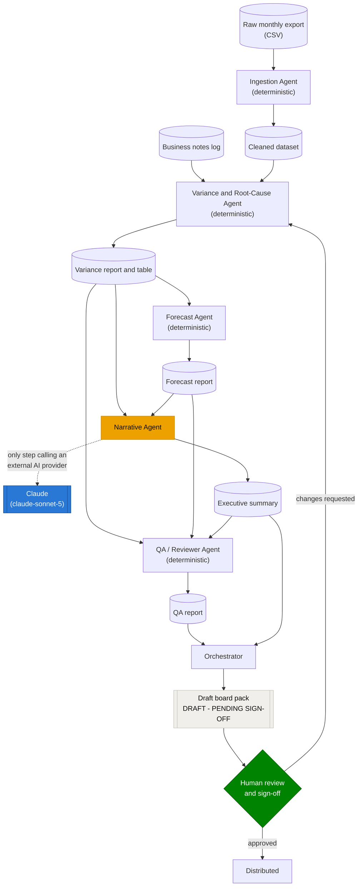

# FP&A Agent Team — EventCo Budget vs Actual & Rolling Forecast

A multi-agent pipeline that runs a monthly FP&A close — Budget vs Actual variance analysis
with root-cause explanations, plus a rolling 3-month forecast — for a fictional
€100M-revenue, multi-business-unit events agency ("EventCo"). Built to demonstrate how to
*manage* a team of AI agents on a real finance workflow: where automation genuinely helps,
where a human has to stay in the loop, and how to keep sensitive data away from AI providers
by design rather than by accident.

## Problem

A monthly Budget vs Actual cycle across several business units is repetitive, slow, and
inconsistent between analysts: cleaning messy source data, computing variances, deciding
which ones are big enough to explain, writing a defensible root cause for each, updating the
forecast, and packaging all of it into something a CFO or board can read — usually redone by
hand every month, with quality depending on who's doing it and how much time they have. Two
failure modes recur in that process: a data-entry typo gets mistaken for a real business
event and someone invents a plausible-sounding story around it, and a genuinely material
variance goes unmentioned or gets a vague, unverifiable explanation because nobody had time
to check.

## Solution

Five agents, each handling one stage of the cycle and handing off to the next via real files
— not five hidden calls inside one black box:

1. **Ingestion** cleans the raw export (typos, duplicates, currency formatting, missing
   values) and flags anything that looks like a data-entry error, without correcting it —
   that decision is left to a human.
2. **Variance & Root-Cause** computes every variance, decides which are material, and
   explains each one only if a dated internal note actually corroborates it — otherwise it
   says so plainly instead of inventing a cause.
3. **Forecast** projects the next 3 months from a *normalized* history — one-off events and
   concluded programmes are excluded from the trend so they aren't extrapolated forward.
4. **Narrative** is the only step that calls an LLM (Claude), and only to turn the two
   already-computed reports into an executive summary — never to reason about the numbers
   itself.
5. **QA/Reviewer** cross-checks the other four agents' outputs against each other and
   verifies, by scanning the actual source code, that only the Narrative Agent touches an
   external AI provider and only with the two aggregated reports.

An **Orchestrator** chains all five and assembles a draft pack — but every run ends with an
explicit **human sign-off gate**, not an automatic publish step. See [Architecture](#architecture)
for the full flow and [Results](#results) for what it actually produces on this dataset.

## Architecture

Six steps, each reading the previous step's output rather than the raw data — the same
handoff a real FP&A team would use, just automated:

**Ingestion → Variance & Root-Cause → Forecast → Narrative → QA → Orchestrator**



The orange node is the only one that ever talks to an external AI provider (the dashed edge);
everything else — including every arrow feeding the diagram's data — is plain, auditable
Python that never leaves the local machine. The green diamond is a real control point, not a
formality: `orchestrator.py` always stops there.

### Why most of this is plain Python, and only one step calls an LLM

Every step through the Forecast Agent is deterministic code: fuzzy-matching business unit
names, applying a materiality threshold, deciding whether a variance is a one-off or a
sustained trend, normalizing history before projecting it forward. These are the decisions
that need to be **auditable and reproducible** — the same input has to produce the same
threshold check every time, and a reviewer has to be able to read the code and see exactly
why a number was flagged, explained, or adjusted. Handing that kind of judgment to an LLM
would make the pack's most important numbers non-reproducible and much harder to defend to
an auditor or a board.

Turning already-computed, already-cited conclusions into a clear executive narrative is a
different kind of problem — it's a language task, not an arithmetic one, and that's exactly
what an LLM is good at. So the **Narrative Agent is the only step in this pipeline that
calls Claude** (Sonnet 5). It is given the finished Variance and Forecast reports and
instructed never to introduce a number, cause, or conclusion that isn't already in them —
the reasoning that could hallucinate a root cause already happened upstream, in plain code
that only cites evidence it can point to (or says plainly that it found none). A separate
validation script checks this after the fact: every figure the narrative mentions is traced
back to a source figure, and it fails loudly if one doesn't match.

### Setup for the Narrative Agent

The Narrative Agent (`agents/narrative_agent.py`) constructs a bare `anthropic.Anthropic()`
client and never hardcodes a credential — it works with whichever of these you set up:

**Option A — API key** (a metered, pay-per-token credential):

```
export ANTHROPIC_API_KEY=sk-ant-...   # macOS/Linux
$env:ANTHROPIC_API_KEY = "sk-ant-..."  # Windows PowerShell
```

**Option B — OAuth via your Claude account** (no separate API key needed — this is the
path used for this project, consistent with the Claude Pro subscription constraint in
CLAUDE.md section 5). Install the [Anthropic CLI](https://github.com/anthropics/anthropic-cli)
(`ant`), then run:

```
ant auth login
```

This opens a browser, authenticates against your Claude account, and stores a short-lived
OAuth profile that the Python SDK picks up automatically — no environment variable required.

### Data governance and human control

This isn't a fully autonomous "black box" — and given financial data sensitivity, it isn't
meant to be:

- **Only one component ever touches an external AI provider.** Ingestion, Variance,
  Forecast, and QA are 100% deterministic Python — no data from those steps leaves the
  local machine. Only the Narrative Agent calls Claude, and it only ever receives the two
  *already-aggregated* summary reports (BU/month-level variance and forecast tables) —
  never the raw dataset, never anything below that aggregation level.
- **This is checked, not just claimed.** The QA/Reviewer Agent (`agents/qa_agent.py`)
  structurally verifies both of the above on every run: it scans every other agent's source
  for any reference to an external AI provider, and confirms the Narrative Agent's own file
  reads are scoped to the two report files. A regression here fails the QA report loudly,
  the same way a hallucinated figure does.
- **Nothing is sent to anyone automatically.** The Orchestrator (`orchestrator.py`) chains
  the pipeline end to end and assembles a single draft pack (`output/board_pack.md`), but
  that pack is explicitly marked **DRAFT — PENDING HUMAN SIGN-OFF** with a literal
  reviewed-by/approved-for-distribution line at the bottom. No step in this pipeline
  publishes, emails, or exports anything — a human always reviews the pack and the QA
  report before either goes anywhere.

## Results

On this synthetic 30-month dataset (4 business units, ~€100M annual revenue):

- **20 variances were material enough to warrant executive commentary.** 4 were grounded in
  a dated internal note and cited by ID — a client project scope change, an FX swing on a
  USD-denominated contract, a cost-savings programme, and a one-off IT incident. The other
  **16 were honestly reported as having no documented driver**, rather than given an
  invented cause, because that's what the evidence log actually supported.
- **One data-entry error (a misplaced digit, ~10x its real value) was caught and excluded**
  before it could reach the Variance Agent and get dressed up as a fake anomaly story — the
  exact trap a rushed manual process is most likely to fall for.
- **The rolling forecast for Q3 2026 projects ~€22.6M in revenue and a 47.9% margin**, built
  by excluding the one-off cost overrun and a concluded savings programme from the trend
  rather than naively extrapolating them forward.


Full generated reports: [`output/variance_report.md`](output/variance_report.md) ·
[`output/forecast_report.md`](output/forecast_report.md) ·
[`output/executive_summary.md`](output/executive_summary.md) ·
[`output/qa_report.md`](output/qa_report.md) · [`output/board_pack.md`](output/board_pack.md)
(the assembled draft, pending sign-off).

## Run it yourself

```
git clone <this repo>
cd fpa-project
python -m venv .venv && .venv/Scripts/pip install -r requirements.txt
.venv/Scripts/python.exe orchestrator.py
```

This runs the full pipeline and prints each agent's own output as it goes, then writes
`output/pipeline_log.md`, `output/qa_report.md`, and `output/board_pack.md`. The Narrative
Agent step needs either `ANTHROPIC_API_KEY` or an `ant auth login` OAuth profile (see
[Setup for the Narrative Agent](#setup-for-the-narrative-agent) above) — without one, that single step is
skipped and logged plainly; everything else still runs and the pack says so explicitly
rather than pretending a narrative exists.

## Tech Stack

- **Python 3.12**, pandas/numpy for the deterministic agents, Faker for the synthetic
  dataset generator, matplotlib for the charts above.
- **Anthropic API** (`claude-sonnet-5`) — used in exactly one place, the Narrative Agent; see
  [Data governance and human control](#data-governance-and-human-control) above for why.
- **Claude Code** (Claude Opus/Sonnet/Fable across sessions) built this repo itself, following
  the model strategy in `CLAUDE.md`: the harder architectural and methodology calls (variance
  materiality rules, forecast normalization logic) went to a more capable model; routine
  scaffolding, dataset generation, and this README went to a faster one.
