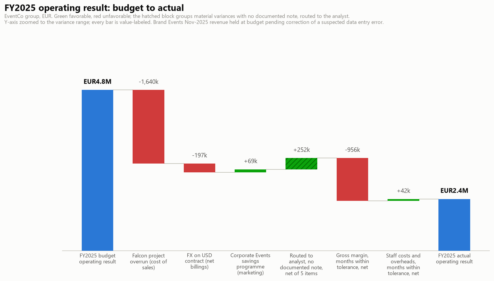
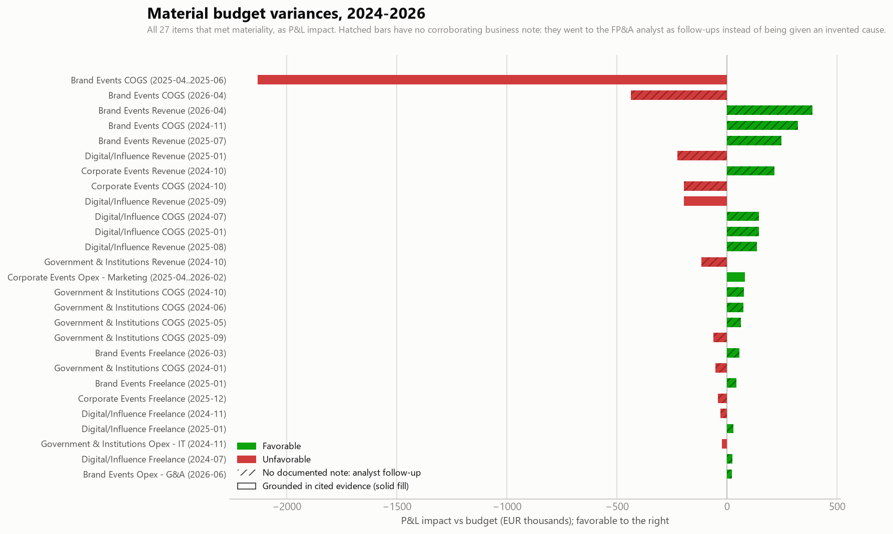
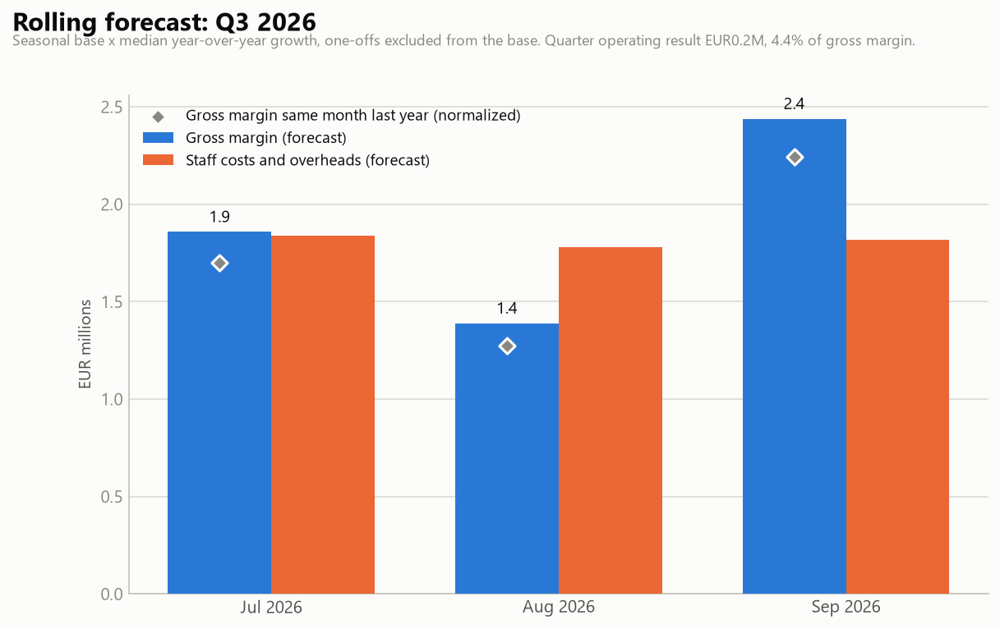
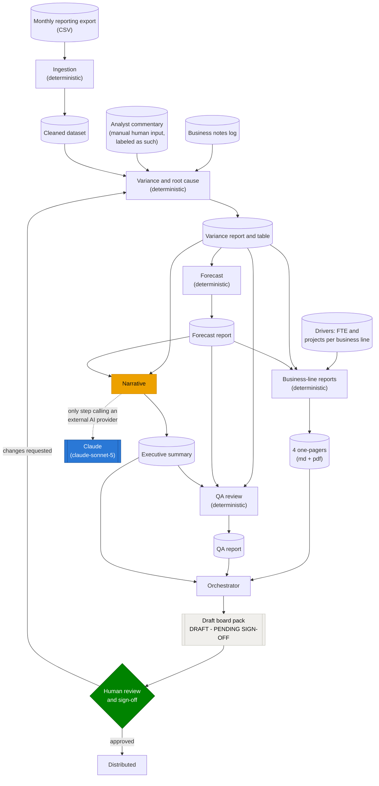

# EventCo: a monthly budget-versus-actual pack with a human sign-off

FY2025 operating result came in at EUR2.4M against a EUR4.8M budget: 10.0% of gross margin
where 18.3% was planned. This repository produces the pack that explains that EUR2.4M gap
for a fictional events agency invoicing EUR100M a year: a EUR1.64M cost-of-sales overrun on
one client project, a EUR197k currency effect on a USD-invoiced contract, EUR69k of
in-housing savings on marketing spend, and 15 further material variances that are either
explained by the analyst or left open and labeled as such. It also catches a billings entry ten times
too large before it reaches any figure or sentence, refreshes next quarter's forecast,
builds a one-page review per business line, and assembles a draft board pack that stops
at a sign-off block.

EventCo is fictional. The monthly cycle is the one I ran as Head of FP&A at a EUR100M
events agency, including stepping in to close the books when the finance director was
out. The overruns, the currency hits and the fat-fingered digits planted in this
dataset are the ones that happen in that job.

**Rather see it than read it?** The [case study page](https://alanvourch.com/fpa-project/)
shows the generated reports themselves.

## What the pack showed

On the synthetic 30-month dataset (4 business lines, about EUR100M annual net billings):

- **The FY2025 walk from budget to actual reconciles to the euro.** Budgeted operating
  result EUR4.8M, actual EUR2.4M. The three named drivers: a EUR1.64M client project
  overrun on cost of sales (a change order recovered only part of it), a EUR197k
  unfavorable FX translation on a USD-invoiced contract, and EUR69k of in-housing savings
  on marketing spend in 2025. Material items with no documented note net out to +EUR252k
  across 5 items and are shown as their own hatched block, labeled as routed to the
  analyst, rather than absorbed into a story. Everything below materiality is shown in two
  more blocks instead of one residual: gross margin in ordinary months landed EUR956k under
  plan, about 3.6% of the EUR26.2M budgeted gross margin, while staff costs and overheads
  came in EUR42k under. No single month of that margin slippage clears the materiality
  tests, yet on an agency whose operating result is under a fifth of gross margin it costs
  a fifth of the year's planned profit, so the walk shows it as its own block. Brand
  Events on its own ends the year at an operating loss of EUR392k against a EUR1.57M
  budgeted profit: the overrun alone is larger than the line's planned result.



- **The one planted data trap was caught.** Brand Events' November 2025 revenue came in at
  10x budget, the signature of an extra digit, not a business event. It was flagged at
  ingestion, excluded from variance analysis, normalized out of the forecast history, and
  mentioned in the executive summary only as a data issue pending correction. Every
  downstream step handled it; none narrated it.
- **Every material variance carries its provenance.** Of the 19 variances that met the
  materiality tests, 4 are corroborated by a dated business note and are the only ones
  the system explains itself. The other 15 went to the FP&A analyst as follow-ups: 13 now
  carry a written explanation labeled "Analyst input" with author and date, and 2 remain
  open and say so. The pack never mixes the three kinds. In this demo the 13 analyst
  explanations are written for illustration over seeded noise (see Known limitations);
  what the demo shows is the workflow and the labeling, not real investigative findings.



- **Every business line gets a one-page review with driver-based commentary.** Brand
  Events' FY2025 page splits its payroll variance into a headcount effect (average 54.6
  FTE vs 55 planned) and a rate effect, and its revenue variance into projects volume (146
  delivered vs 141 planned) and price/mix. Both splits reconcile exactly to the reported
  variances (asserted in code, re-checked by a validator), and the commentary cites the
  same evidence notes as the variance report. See
  [`output/bu_reports/brand_events.pdf`](output/bu_reports/brand_events.pdf) and its three
  siblings, each also available as Markdown.

- **The Q3 2026 rolling forecast projects EUR22.6M of net billings and EUR5.69M of gross
  margin, with an operating result of EUR248k (4.4% of gross margin)**, built from each
  line's own seasonal base and median year-over-year growth, with 32 distorted
  month-values normalized out of the history first (each one logged with its reason and
  evidence). The quarter is the seasonal trough of an events year: August is forecast at
  an operating loss of EUR392k, which the pack states rather than smooths.



Full generated reports: [`output/variance_report.md`](output/variance_report.md) ·
[`output/forecast_report.md`](output/forecast_report.md) ·
[`output/executive_summary.md`](output/executive_summary.md) ·
[`output/qa_report.md`](output/qa_report.md) ·
[`output/board_pack.md`](output/board_pack.md) (the assembled draft, pending sign-off).

## What goes in

The input is a monthly management reporting export, not a ledger: one row per business
line per month with budget and actual for eleven P&L lines, for four business lines over
30 months. That is 120 rows once cleaned, and 1,320 budget-versus-actual tests (120 rows
times 11 lines). Alongside it: a log of dated business notes from the operating teams, a
file of analyst commentary, and monthly headcount and projects delivered per business
line from the HR and operations systems. There are no journal entries, accruals or
reconciliations in scope; this is the reporting pack that follows a close, not the close
itself.

The P&L has the shape of a French events agency's management accounts. Net billings are
what clients are invoiced, about EUR100M a year. Cost of sales is everything bought for
client projects: venues, technical suppliers, staging, catering, freight, media, and the
freelance and intermittent crews hired per project. What remains is the gross margin, the
agency's real net revenue, at about a quarter of billings. In the base year, on EUR102.6M
of billings and EUR25.5M of gross margin: staff costs (gross salaries, employer social
charges, and bonuses with profit sharing, for 150 FTE) take about 60% of gross margin;
overheads (office rent and facilities, IT and telecoms, new business and the agency's own
advertising, professional fees and other G&A, non-billable travel, depreciation) take
about 22%; the operating result is about 18% of gross margin, 4.5% of billings. FY2025
budgets plan between 16% and 21% of gross margin by business line.

The export arrives with the problems a real one has, planted on purpose: typos in
business-line names, duplicate rows, amounts typed as text with currency formatting, four
date formats, missing overhead cells, and one revenue figure with an extra digit that is
shaped exactly like a large business anomaly. The dataset also carries four genuine
business events with documented causes. Two failure modes of a manual pack are targeted
directly:

- **A data-entry typo becomes a business story.** Someone books EUR52M of revenue instead
  of EUR5.2M, and a rushed analyst writes a confident narrative around a fat-fingered
  digit.
- **A material variance gets a vague cause, or none.** Under time pressure, "timing" and
  "mix effects" cover a lot of numbers nobody investigated.

## How it works

Six steps, each a separate Python script handing off through files rather than hidden
calls inside one program:

1. **Ingestion** cleans the export (typos, duplicates, currency-formatted text, mixed
   date formats, missing values) and flags the 10x revenue row as a probable data-entry
   error, without correcting it. That decision stays with a human.
2. **Variance and root cause** computes all 1,320 variances, applies a three-rule
   materiality test, and explains a variance only when a dated internal business note
   corroborates it. Anything unexplained goes to the FP&A analyst as a follow-up; the
   analyst's findings come back through `data/analyst_commentary.csv` and are rendered
   clearly labeled as manual input, never blended with machine-found evidence. Items with
   neither say "no clear driver identified" and stay open. The flagged data-error row is
   excluded before analysis, so the typo can never be dressed up as a story.
3. **Forecast** projects the next three months from a normalized history: one-off events
   and concluded programmes are removed from the base so last year's accident is not
   re-forecast as this year's plan. Every adjustment is logged in an audit trail with its
   evidence.
4. **Business-line reports** build a one-page review per business line from the variance
   table, the forecast and the operational drivers (monthly FTE and projects delivered):
   a budget-to-actual bridge, the payroll variance split into headcount vs rate, the
   revenue variance split into volume vs price/mix (both reconcile exactly, asserted),
   the material variances with their labeled explanations, follow-ups, and next
   quarter's outlook. Exported as Markdown and a print-ready PDF.
5. **Narrative** turns the two finished reports into an executive summary. This is the
   only step that calls a language model (Claude), and it is instructed never to
   introduce a number, cause, or conclusion that is not already in its inputs. A
   validation script then traces every figure in the prose back to a source figure
   (tolerance: 0.5% relative and EUR15,000 absolute, both required).
6. **QA review** cross-checks the other steps' outputs against each other and verifies,
   by scanning the source code, that only the narrative step references an external AI
   provider and that its file reads are limited to the two aggregated reports.

An orchestrator runs all six as separate processes and assembles
`output/board_pack.md`, which ends in a literal DRAFT banner and a reviewed-by /
approved-for-distribution sign-off block. Nothing in this repository sends anything
anywhere.

## Architecture


```mermaid
flowchart TD
    RAW[("Monthly reporting export\n(CSV)")] --> ING["Ingestion\n(deterministic)"]
    ING --> CLEAN[("Cleaned dataset")]
    NOTES[("Business notes log")] --> VAR
    ANA[("Analyst commentary\n(manual human input,\nlabeled as such)")] --> VAR
    CLEAN --> VAR["Variance and root cause\n(deterministic)"]
    VAR --> VTAB[("Variance report and table")]
    VTAB --> FC["Forecast\n(deterministic)"]
    FC --> FTAB[("Forecast report")]
    DRV[("Drivers: FTE and\nprojects per business line")] --> BUR
    VTAB --> BUR["Business-line reports\n(deterministic)"]
    FTAB --> BUR
    BUR --> BUPACK[("4 one-pagers\n(md + pdf)")]
    BUPACK --> ORCH
    VTAB --> NARR["Narrative"]
    FTAB --> NARR
    NARR -.->|"only step calling an\nexternal AI provider"| LLM[["Claude\n(claude-sonnet-5)"]]
    NARR --> EXEC[("Executive summary")]
    VTAB --> QA["QA review\n(deterministic)"]
    FTAB --> QA
    EXEC --> QA
    QA --> QAREP[("QA report")]
    QAREP --> ORCH["Orchestrator"]
    EXEC --> ORCH
    ORCH --> PACK[["Draft board pack\nDRAFT - PENDING SIGN-OFF"]]
    PACK --> HUMAN{"Human review\nand sign-off"}
    HUMAN -->|approved| OUT["Distributed"]
    HUMAN -->|changes requested| VAR

    style LLM fill:#2a78d6,color:#fff,stroke:#184f95
    style NARR fill:#eda100,color:#0b0b0b,stroke:#c98500
    style HUMAN fill:#008300,color:#fff,stroke:#005900
    style PACK fill:#f0efec,color:#0b0b0b,stroke:#c3c2b7
```

The orange node is the only one that ever talks to an external AI provider (the dashed
edge). Everything else is plain Python running locally. The green diamond is a real
control point: `orchestrator.py` always stops there.

### Why five steps are plain Python and only one calls a language model

Materiality thresholds, evidence matching, episode detection, and history normalization
decide which numbers reach a board. Those decisions must be reproducible (same input,
same flag, every time) and auditable (a reviewer can read the code and see exactly why a
row was flagged). Handing them to a language model would make the pack's most important
numbers impossible to defend to an auditor.

Writing readable prose from already-computed, already-cited conclusions is a different
kind of task, and it is the one a language model is good at. So the narrative step gets
the two finished reports and a strict instruction set: no new numbers, no new causes,
keep "no clear driver identified" honest, cover the favorable story as prominently as the
bad news. The grounding validator then checks the output figure by figure and fails
loudly on anything it cannot trace. During development that validator caught a fabricated
round EUR500,000 that happened to land within 1% of an unrelated real budget line, which
is why the tolerance is a tight 0.5% AND EUR15,000 rather than "close enough".

### Data governance and human control

- **Only one component ever touches an external AI provider.** Ingestion, variance,
  forecast, business-line reports and QA never leave the local machine. The narrative
  step receives only the two aggregated summary reports, never the raw export, never the
  driver data, never anything below business-line/month aggregation.
- **This is checked structurally, not asserted.** On every run, the QA step scans the
  other scripts' source for any AI-provider reference and inspects the narrative script's
  actual `open()` calls. A regression fails the QA report the same way a hallucinated
  figure does.
- **Nothing is sent anywhere automatically.** The board pack is assembled as an explicit
  draft with a sign-off block. Distribution is a human decision made outside this code.

## Known limitations

The known gaps are listed here rather than left for a close reading of the logs:

- **The ingestion step's informational outlier tier is weak on sustained anomalies.**
  Its IQR-based "notable variance" flags surfaced only 5 of the 11 planted anomaly-months
  (a long anomaly contaminates its own baseline). The two hard requirements still hold
  exactly: the data trap was caught, and no real anomaly was misclassified as an error.
  The variance step computes its own materiality independently and found all 11.
- **The episode detector can overstate a window.** The Corporate Events savings programme
  started in July 2025, but the detected episode spans April 2025 to February 2026
  because adjacent same-direction noise months get bridged into the run. The executive
  summary discloses this rather than papering over it.
- **The narrative trap check is keyword-based.** It verifies that data-quality language
  is never paired with business-event framing, but it could not catch a narrative that
  invents a business story while avoiding data-quality words entirely. The figure-tracing
  check is the harder net behind it.
- **The dataset is synthetic and seeded.** The anomalies and errors were planted, so task
  difficulty is calibrated by construction. The scripts never read the answer key
  (`data/ground_truth.md`); separate validation scripts in `tests/` check their outputs
  against it after the fact, and all six pass.
- **The analyst commentary is written for illustration.** The 13 "Analyst input" rows
  were written for this demo the way a real analyst would write them after follow-up,
  but the underlying variances are seeded generator noise, so those explanations are
  plausible fiction, documented as such here and on the case study page. What the demo
  shows is the workflow and the provenance labeling, not real investigative findings.
- **Driver splits reconcile exactly because the driver data is consistent by
  construction.** `data/generate_drivers.py` derives monthly FTE and project counts from
  the same seeded world as the P&L, which is what makes payroll = FTE x rate and
  revenue = volume x price tie out to the cent on every one-pager. Real HR and CRM
  extracts never reconcile this cleanly; on real data the one-pagers would need a
  reconciliation tolerance and an explicit unallocated line.
- **Support functions and overheads are allocated to the business lines.** Finance, HR
  and management staff sit inside the 150 FTE of the four lines, and rent, IT, G&A and
  depreciation are allocated by headcount or gross margin, so each business-line P&L is
  fully loaded. A real pack would also show the central cost centre before allocation.

## Run it yourself

Requires Python 3.12 (tested) and git. Run everything from the repository root; all paths
are relative.

**Windows (PowerShell):**

```powershell
git clone https://github.com/alanvourch/fpa-project.git
cd fpa-project
python -m venv .venv
.venv\Scripts\pip install -r requirements.txt
.venv\Scripts\python.exe orchestrator.py
```

**macOS / Linux:**

```bash
git clone https://github.com/alanvourch/fpa-project.git
cd fpa-project
python3 -m venv .venv
.venv/bin/pip install -r requirements.txt
.venv/bin/python orchestrator.py
```

This runs the full pipeline, prints each step's output, and writes
`output/pipeline_log.md`, `output/qa_report.md`, `output/board_pack.md`, and the four
one-pagers in `output/bu_reports/`. The run is deterministic: regenerated outputs are
byte-identical apart from timestamps.

The charts in `docs/` are regenerated with `make_charts.py` (same interpreter), and the
validation suite is the six `tests/validate_*.py` scripts.

**Narrative step credentials** (optional; every other step runs without them). The
script builds a bare `anthropic.Anthropic()` client, so any of these work:

- *API key*: set `ANTHROPIC_API_KEY` in your environment (never committed; `.env` is
  git-ignored).
- *OAuth via your Claude account*: install the
  [Anthropic CLI](https://github.com/anthropics/anthropic-cli) (`ant`), run
  `ant auth login`, and the Python SDK picks up the stored profile automatically.
- *A company's internal model gateway, or another approved provider*: the same client
  construction resolves whatever `ANTHROPIC_API_KEY`/`ANTHROPIC_BASE_URL` (or an
  organization's OAuth profile) point it at. Nothing in `agents/narrative_agent.py` is
  tied to a personal account; swapping the credential source is a configuration change,
  not a code change.

Without credentials, the narrative step is skipped and logged plainly, and the board pack
labels the carried-over or missing narrative instead of pretending one was generated.

## Tech stack

- **Python 3.12** with pandas and numpy for the deterministic steps, Faker for the
  synthetic dataset generator, matplotlib for the charts, fpdf2 for the one-pager PDFs.
- **Anthropic API** (`claude-sonnet-5`) in exactly one place, the narrative step.
