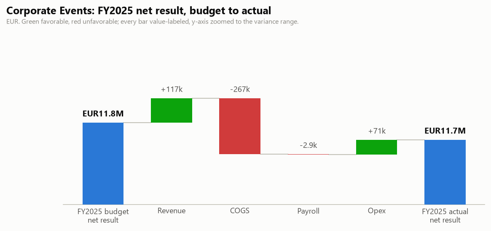

# Corporate Events: FY2025 Budget vs Actual and Q3 2026 Outlook

One-page business review for the BU manager. Generated by `agents/bu_report_agent.py` from the pipeline's own outputs (`output/variance_table.csv`, `output/forecast.csv`, `data/eventco_drivers.csv`, `data/business_notes.csv`). This agent never reads `data/ground_truth.md`.

## FY2025 scorecard

| | Actual | Budget | Variance |
|---|---|---|---|
| Revenue | EUR21,317,881 | EUR21,200,817 | +117k |
| Total costs | EUR9,605,592 | EUR9,406,879 | +199k |
| Net result | EUR11,712,289 | EUR11,793,938 | -82k |

Net margin 54.9%.

## What drove it

- **Payroll ran +2.9k vs budget.** Headcount effect +0.0k (average 20.0 FTE vs 20.0 planned), rate effect +2.9k (salary mix, overtime and timing). The two effects reconcile exactly to the payroll variance.
- **Revenue ran +117k vs budget.** Volume effect -202k (210 projects delivered vs 212 planned), price/mix effect +319k. The two effects reconcile exactly to the revenue variance.

## Material variances (full 30-month window)

| Period | Line | Variance EUR | % | F/U | Driver |
|---|---|---|---|---|---|
| 2024-10 | Revenue | +215,565 | +10.5% | F | A brand activation sold for early 2025 was pulled into October at the client's request. (analyst input, manual) |
| 2024-10 | COGS | +125,565 | +17.4% | U | Production costs of the pulled-forward October activation; (analyst input, manual) |
| 2025-04..2026-02 | Opex - Marketing | -81,464 | -16.4% | F | Media buying and content creation move in-house from 1 July; (business note N12, N16) |
| 2024-06 | COGS | -75,009 | -10.5% | F | The June campaign reused spring creative assets instead of commissioning a new shoot. (analyst input, manual) |
| 2025-12 | COGS | +71,249 | +10.3% | U | No clear driver identified; still open with the BU controller. |
| 2025-03 | COGS | +55,202 | +10.0% | U | Print and media rates increased at the main supplier from March; (analyst input, manual) |

## Follow-ups

- COGS 2025-12: +71k (+10.3%, unfavorable). No documented driver and no analyst input yet; still open with the BU controller.

## Q3 2026 outlook (Jul 2026 / Aug 2026 / Sep 2026)

Revenue EUR4,477,452 (+5.1% vs the same quarter last year), total costs EUR2,093,500 (+3.6%), net result EUR2,383,952 at a 53.2% margin. One-off events and concluded programmes are excluded from the forecast base; see the forecast report's audit trail.

---

DRAFT: pending human sign-off. Nothing in this pipeline distributes reports on its own.
