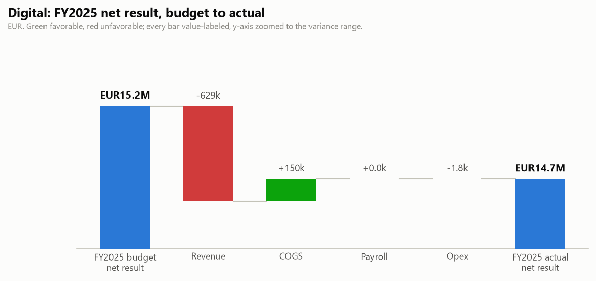

# Digital: FY2025 Budget vs Actual and Q3 2026 Outlook

One-page business review for the BU manager. Generated by `agents/bu_report_agent.py` from the pipeline's own outputs (`output/variance_table.csv`, `output/forecast.csv`, `data/eventco_drivers.csv`, `data/business_notes.csv`). This agent never reads `data/ground_truth.md`.

## FY2025 scorecard

| | Actual | Budget | Variance |
|---|---|---|---|
| Revenue | EUR25,872,171 | EUR26,501,022 | -629k |
| Total costs | EUR11,138,326 | EUR11,287,052 | -149k |
| Net result | EUR14,733,845 | EUR15,213,970 | -480k |

Net margin 56.9%.

## What drove it

- **Payroll ran -0.0k vs budget.** Headcount effect -12k (average 39.8 FTE vs 40.0 planned), rate effect +12k (salary mix, overtime and timing). The two effects reconcile exactly to the payroll variance.
- **Revenue ran -629k vs budget.** Volume effect -688k (148 projects delivered vs 152 planned), price/mix effect +59k. The two effects reconcile exactly to the revenue variance.

## Material variances (full 30-month window)

| Period | Line | Variance EUR | % | F/U | Driver |
|---|---|---|---|---|---|
| 2025-01 | Revenue | -224,810 | -14.8% | U | No clear driver identified; follow up with the BU controller. |
| 2025-09 | Revenue | -196,953 | -9.3% | U | NovaTech (US client) roadshow is invoiced in USD. (notes N08) |
| 2024-12..2025-01 | COGS | -143,626 | -12.3% | F | No clear driver identified; follow up with the BU controller. |
| 2025-08 | Revenue | +135,341 | +10.2% | F | No clear driver identified; follow up with the BU controller. |
| 2024-07 | COGS | -84,412 | -15.6% | F | No clear driver identified; follow up with the BU controller. |
| 2025-06 | COGS | -82,563 | -10.4% | F | No clear driver identified; follow up with the BU controller. |
| 2025-03 | COGS | +66,523 | +11.3% | U | No clear driver identified; follow up with the BU controller. |

## Follow-ups

- Revenue 2025-01: -225k (-14.8%, unfavorable). No documented driver; review with the BU controller.
- COGS 2024-12..2025-01: -144k (-12.3%, favorable). No documented driver; review with the BU controller.
- Revenue 2025-08: +135k (+10.2%, favorable). No documented driver; review with the BU controller.
- 3 further material item(s) without a documented driver; see the variance report for the full list.

## Q3 2026 outlook (Jul 2026 / Aug 2026 / Sep 2026)

Revenue EUR5,618,362 (+4.6% vs the same quarter last year), total costs EUR2,508,575 (+1.9%), net result EUR3,109,788 at a 55.4% margin. One-off events and concluded programmes are excluded from the forecast base; see the forecast report's audit trail.

---

DRAFT: pending human sign-off. Nothing in this pipeline distributes reports on its own.
