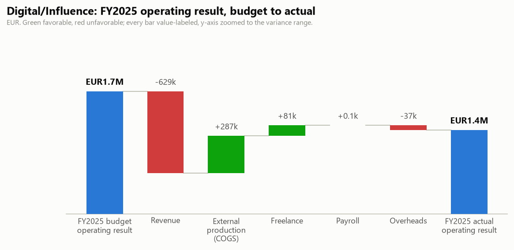

# Digital/Influence: FY2025 Budget vs Actual and Q3 2026 Outlook

One-page business review for the BU manager. Generated by `agents/bu_report_agent.py` from the pipeline's own outputs (`output/variance_table.csv`, `output/forecast.csv`, `data/eventco_drivers.csv`, `data/business_notes.csv`). This agent never reads `data/ground_truth.md`.

## FY2025 scorecard

| | Actual | Budget | Variance |
|---|---|---|---|
| Revenue | EUR25,872,171 | EUR26,501,022 | -629k |
| Total costs | EUR24,505,016 | EUR24,836,461 | -331k |
| Operating result | EUR1,367,155 | EUR1,664,560 | -297k |

Operating margin 5.3%.

## What drove it

- **Payroll ran -0.1k vs budget.** Headcount effect -18k (average 35.8 FTE vs 36.0 planned), rate effect +18k (salary mix, overtime and timing). The two effects reconcile exactly to the payroll variance.
- **Revenue ran -629k vs budget.** Volume effect +355k (154 projects delivered vs 152 planned), price/mix effect -984k. The two effects reconcile exactly to the revenue variance.

## Material variances (full 30-month window)

| Period | Line | Variance EUR | % | F/U | Driver |
|---|---|---|---|---|---|
| 2025-01 | Revenue | -224,810 | -14.8% | U | Two platform go-lives slipped from January into February on client-side content delays. (analyst input, manual) |
| 2025-09 | Revenue | -196,953 | -9.3% | U | NovaTech (US client) roadshow is invoiced in USD. (business note N08) |
| 2024-07 | COGS | -145,678 | -13.7% | F | Contractor spend deferred during the summer staffing gap on the delivery bench; (analyst input, manual) |
| 2025-01 | COGS | -145,065 | -16.2% | F | External development spend paused over the year-end delivery freeze and resumed in February, alongside the two go-lives that sl... (analyst input, manual) |
| 2025-08 | Revenue | +135,341 | +10.2% | F | One retainer client commissioned an out-of-cycle campaign microsite in an otherwise quiet August. (analyst input, manual) |
| 2024-11 | Freelance | +30,647 | +11.0% | U | Freelance motion designers booked to cover a vacant post through the November campaign peak. (analyst input, manual) |
| 2025-01 | Freelance | -28,193 | -18.6% | F | Freelance bookings paused with the two platform go-lives that slipped into February; (analyst input, manual) |
| 2024-07 | Freelance | -23,674 | -13.1% | F | Freelance day rates paused over the same summer gap as the deferred contractor work; (analyst input, manual) |

## Follow-ups

- No open follow-ups this cycle.

## Q3 2026 outlook (Jul 2026 / Aug 2026 / Sep 2026)

Revenue EUR5,618,362 (+4.6% vs the same quarter last year), total costs EUR5,525,241 (+2.6%), operating result EUR93,121 at a 1.7% margin. One-off events and concluded programmes are excluded from the forecast base; see the forecast report's audit trail.

---

DRAFT: pending human sign-off. Nothing in this pipeline distributes reports on its own.
