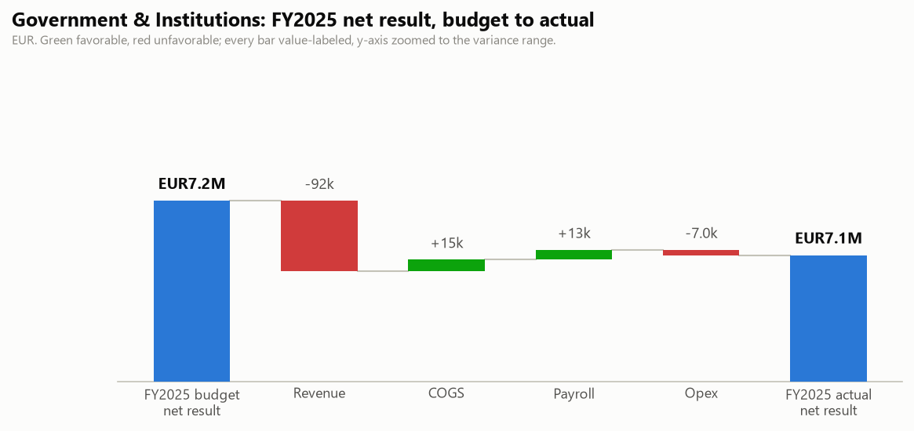

# Government & Institutions: FY2025 Budget vs Actual and Q3 2026 Outlook

One-page business review for the BU manager. Generated by `agents/bu_report_agent.py` from the pipeline's own outputs (`output/variance_table.csv`, `output/forecast.csv`, `data/eventco_drivers.csv`, `data/business_notes.csv`). This agent never reads `data/ground_truth.md`.

## FY2025 scorecard

| | Actual | Budget | Variance |
|---|---|---|---|
| Revenue | EUR10,508,792 | EUR10,600,409 | -92k |
| Total costs | EUR3,405,132 | EUR3,426,064 | -21k |
| Net result | EUR7,103,660 | EUR7,174,345 | -71k |

Net margin 67.6%.

## What drove it

- **Payroll ran -13k vs budget.** Headcount effect -15k (average 34.8 FTE vs 35.0 planned), rate effect +1.8k (salary mix, overtime and timing). The two effects reconcile exactly to the payroll variance.
- **Revenue ran -92k vs budget.** Volume effect -149k (209 projects delivered vs 212 planned), price/mix effect +57k. The two effects reconcile exactly to the revenue variance.

## Material variances (full 30-month window)

| Period | Line | Variance EUR | % | F/U | Driver |
|---|---|---|---|---|---|
| 2024-10 | Revenue | -115,950 | -11.3% | U | Two institutional clients pushed their October milestone invoicing into November after a budget-cycle approval delay on their s... (analyst input, manual) |
| 2024-11 | Opex - IT | +24,116 | +158.1% | U | On-site registration and AV control systems failed during a ministry summit engagement on 4 November; (business note N06) |

## Follow-ups

- No open follow-ups this cycle.

## Q3 2026 outlook (Jul 2026 / Aug 2026 / Sep 2026)

Revenue EUR2,323,592 (+6.4% vs the same quarter last year), total costs EUR858,711 (+5.1%), net result EUR1,464,881 at a 63.0% margin. One-off events and concluded programmes are excluded from the forecast base; see the forecast report's audit trail.

---

DRAFT: pending human sign-off. Nothing in this pipeline distributes reports on its own.
