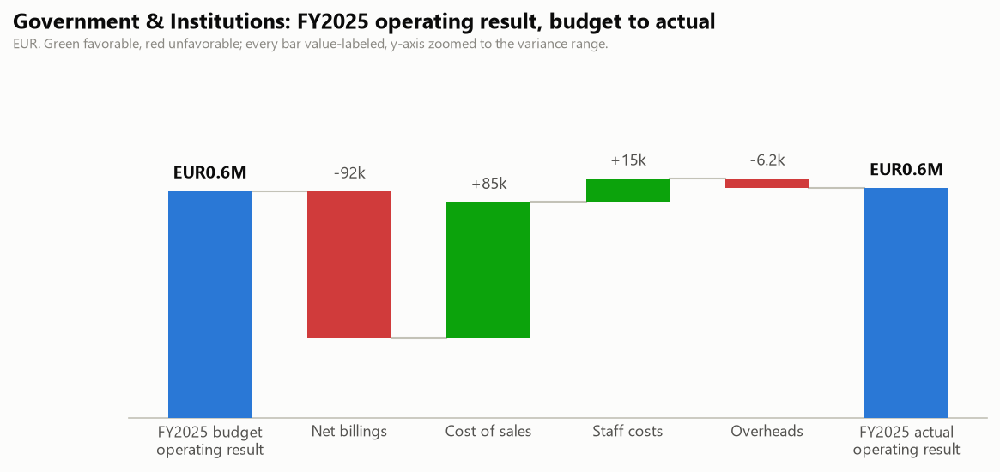

# Government & Institutions: FY2025 Budget vs Actual and Q3 2026 Outlook

One-page business review for the BU manager. Generated by `agents/bu_report_agent.py` from the pipeline's own outputs (`output/variance_table.csv`, `output/forecast.csv`, `data/eventco_drivers.csv`, `data/business_notes.csv`). This agent never reads `data/ground_truth.md`.

## FY2025 scorecard

| | Actual | Budget | Variance |
|---|---|---|---|
| Net billings | EUR10,508,792 | EUR10,600,409 | -92k |
| Gross margin | EUR3,173,554 | EUR3,180,123 | -6.6k |
| Staff costs and overheads | EUR2,585,431 | EUR2,593,877 | -8.4k |
| Operating result | EUR588,123 | EUR586,245 | +1.9k |

Operating margin 18.5% of gross margin, 5.6% of net billings.

## What drove it

- **Payroll ran -7.4k vs budget.** Headcount effect +0.0k (average 20.0 FTE vs 20.0 planned), rate effect -7.4k (salary mix, overtime and timing). The two effects reconcile exactly to the payroll variance.
- **Net billings ran -92k vs budget.** Volume effect -149k (209 projects delivered vs 212 planned), price/mix effect +57k. The two effects reconcile exactly to the net billings variance.

## Material variances (full 30-month window)

| Period | Line | Variance EUR | % | F/U | Driver |
|---|---|---|---|---|---|
| 2024-10 | Net billings | -115,950 | -11.3% | U | Two institutional clients pushed their October milestone invoicing into November after a budget-cycle approval delay on their s... (analyst input, manual) |
| 2024-10 | Cost of sales | -91,742 | -12.7% | F | Delivery costs of the two milestones that slipped into November were held back with them; (analyst input, manual) |
| 2024-06 | Cost of sales | -81,713 | -11.5% | F | The June conference was held in a client-owned venue instead of the hired venue assumed in budget; (analyst input, manual) |
| 2025-09 | Cost of sales | +68,616 | +11.6% | U | No clear driver identified; still open with the BU controller. |
| 2024-01 | Cost of sales | +55,386 | +13.6% | U | January carried final supplier invoices for a December 2023 conference that arrived after the prior-year cut-off. (analyst input, manual) |
| 2024-11 | Opex - IT | +24,116 | +158.1% | U | On-site registration and AV control systems failed during a ministry summit engagement on 4 November; (business note N06) |

## Follow-ups

- Cost of sales 2025-09: +69k (+11.6%, unfavorable). No documented driver and no analyst input yet; still open with the BU controller.

## Q3 2026 outlook (Jul 2026 / Aug 2026 / Sep 2026)

Net billings EUR2,323,592 (+6.4% vs the same quarter last year), gross margin EUR735,770 (+6.2%), operating result EUR65,056, 8.8% of gross margin. One-off events and concluded programmes are excluded from the forecast base; see the forecast report's audit trail.

---

DRAFT: pending human sign-off. Nothing in this pipeline distributes reports on its own.
