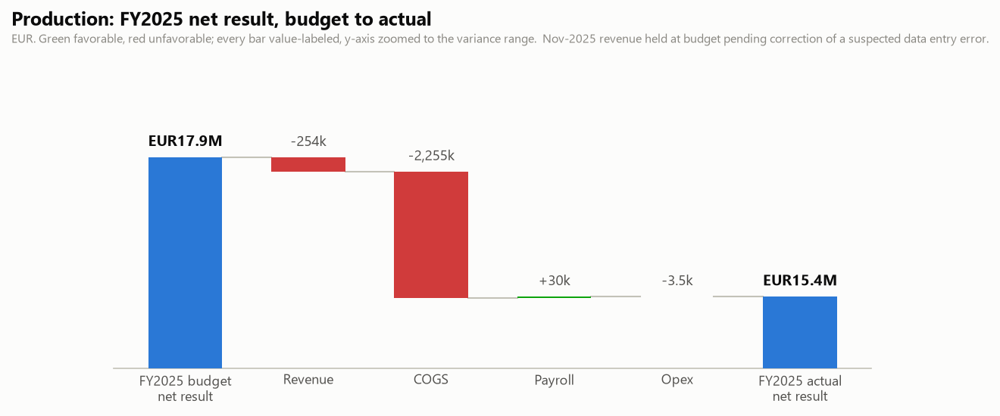

# Production: FY2025 Budget vs Actual and Q3 2026 Outlook

One-page business review for the BU manager. Generated by `agents/bu_report_agent.py` from the pipeline's own outputs (`output/variance_table.csv`, `output/forecast.csv`, `data/eventco_drivers.csv`, `data/business_notes.csv`). This agent never reads `data/ground_truth.md`.

## FY2025 scorecard

| | Actual | Budget | Variance |
|---|---|---|---|
| Revenue | EUR47,447,991 | EUR47,701,839 | -254k |
| Total costs | EUR32,074,155 | EUR29,845,798 | +2,228k |
| Net result | EUR15,373,836 | EUR17,856,040 | -2,482k |

Net margin 32.4%. Nov-2025 revenue held at budget pending correction of a suspected data entry error.

## What drove it

- **Payroll ran -30k vs budget.** Headcount effect -25k (average 54.6 FTE vs 55.0 planned), rate effect -4.4k (salary mix, overtime and timing). The two effects reconcile exactly to the payroll variance.
- **Revenue ran -254k vs budget (excluding the month pending data correction).** Volume effect -311k (140 projects delivered vs 141 planned), price/mix effect +57k. The two effects reconcile exactly to the revenue variance.
- *Data note:* 2025-11 is excluded from the revenue split above. The ops system shows normal activity that month (18 projects delivered vs 17 planned), which supports treating the recorded revenue figure as a data entry error rather than a business event.

## Material variances (full 30-month window)

| Period | Line | Variance EUR | % | F/U | Driver |
|---|---|---|---|---|---|
| 2025-04..2025-06 | COGS | +2,077,456 | +26.6% | U | Falcon product-launch event (Riyadh): client requested a major on-site scope expansion during build week. (business note N11, N13) |
| 2026-04 | COGS | +407,217 | +15.7% | U | An unplanned client project was won in late March and delivered inside April; (analyst input, manual) |
| 2026-04 | Revenue | +388,823 | +8.3% | F | Unbudgeted revenue from the same late-won April project; (analyst input, manual) |
| 2024-11 | COGS | -294,277 | -10.6% | F | November events were delivered with in-house crew and staging stock instead of the subcontracting assumed in budget; (analyst input, manual) |
| 2025-07 | Revenue | +247,346 | +7.3% | F | A client brought part of its September roadshow forward into July. (analyst input, manual) |

## Follow-ups

- Correct the Nov-2025 revenue entry at source: the recorded figure fails the magnitude plausibility check while the ops system shows normal project activity, so it is treated as a data error, not performance.

## Q3 2026 outlook (Jul 2026 / Aug 2026 / Sep 2026)

Revenue EUR10,194,222 (+6.1% vs the same quarter last year), total costs EUR6,322,113 (+4.3%), net result EUR3,872,109 at a 38.0% margin. One-off events and concluded programmes are excluded from the forecast base; see the forecast report's audit trail.

---

DRAFT: pending human sign-off. Nothing in this pipeline distributes reports on its own.
